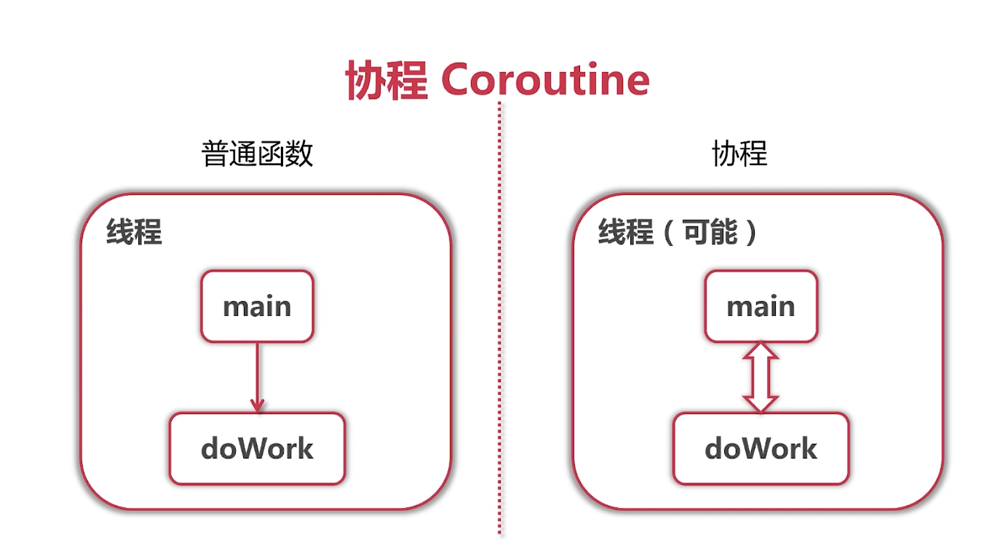

## 第10章 Goroutine
### 10-1 goroutine
- go语言对并发有着原生支持  
- 函数之前增加**go**关键字, 开了一个协程Coroutine    

**协程Coroutine**  
- 轻量级"线程"  
- 非抢占式多任务处理, 由协程主动交出控制权  
- 编译器/解释器/虚拟机层面的多任务(Go有着自己的调度器, 不是操作系统层面的)  
- 多个协程可能在一个或多个线程上运行  

- 手动交出控制权: runtime.Gosched()  

```
func main() {
	for i := 0; i < 10; i++ {
		go func(i int) {
			for { //如果一直死循环, 所有的线程及核心数都会被占用,并且其他协程无法得到执行  
				fmt.Printf("Hello from "+
					"goroutine %d\n", i)
			}
		}(i)
	}
	time.Sleep(time.Minute)
}
```

### 10-2 go语言的调度器
- 子程序是协程一个特例  
- 多个协程是否在一个线程中呢? 由调度器决定  
- 任何函数只需要加上go就能送给调度器运行 
- 使用go run -race检测数据冲突  

```
top 
// 从top的信息可以看出, 开启了10个协程, 活跃的线程只有4个(87/4)
PID    COMMAND      %CPU  TIME     #TH   #WQ  #PORTS MEM    PURG   CMPRS  PGRP  PPID  STATE    BOOSTS
1968   idea         119.4 47:17.25 87/4  4    546-   2647M- 33M    522M   1968  1     running  *0[4491]
143    WindowServer 76.0  68:45.33 16    6    3340   1433M- 6208K  70M    143   1     sleeping *0[1]
```

**goroutine可能的切换点**  
- I/O, select 
- 函数调用时(有时)
- channel 
- runtime.Gosched()  
- 等待锁
- 知识参考, 不能保证切换, 不能保证在其他地方不切换  


<br>
<div align=center>
    </img>  
</div>
<br>


