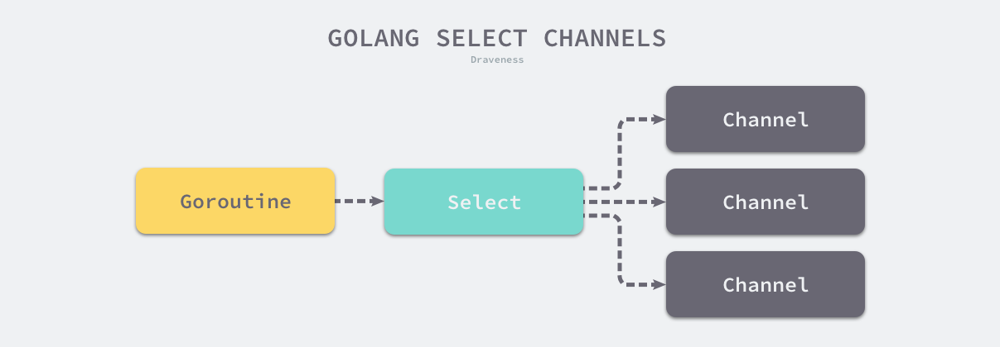

## 第11章 Channel
### 11-1 channel
- channel 缓存区为1
- buffered channel 可以设置缓存区大小
- range 可以使用两个值访问channel, 另外使用range
- 理论基础:Communication Sequential Process (CSP)

**查看channel的数据结构**  
//源码位置: src/runtime/chan.go  

需要注意几个概念:  
- 队列数据个数   
- 环形队列大小(缓存大小), 环形队列的底层实现是**线性数组**!
- 发送/接收数据索引
- 发送/接收等待队列

> 目前理解通道就是一个环形队列, 发送与接收位置通过索引控制, 另个环形队列的索引也有维护!   

```
type hchan struct {
	qcount   uint           // total data in the queue 
	dataqsiz uint           // size of the circular queue  环形队列 
	buf      unsafe.Pointer // points to an array of dataqsiz elements  环形队列的具体实现及地址  
	elemsize uint16
	closed   uint32
	elemtype *_type // element type
	sendx    uint   // send index
	recvx    uint   // receive index
	recvq    waitq  // list of recv waiters 接收等待队列
	sendq    waitq  // list of send waiters 发送等待队列

	// lock protects all fields in hchan, as well as several
	// fields in sudogs blocked on this channel.
	//
	// Do not change another G's status while holding this lock
	// (in particular, do not ready a G), as this can deadlock
	// with stack shrinking.
	lock mutex
}
```


go语言创始人的一句话:  
- 不要通过共享内存来通信, 通过通信来共享内存    

[网文对Go管道的理解](https://lailin.xyz/post/go-training-week3-channel.html)  
现在需要通过两个goroutine的收发来理解通道:  


### 11-2 使用Channel等待任务结束

这让我想起了Java的闭锁(Latch)和栅栏(CyclicBarrier)  
栅栏类似于闭锁，它能阻塞一组线程直到某个事件发生。 栅栏与闭锁的关键区别在于，所有的线程必须同时到达栅栏位置，才能继续执行。闭锁用于等待事件，而栅栏用于等待其他线程。    

WaitGroup 就类似与闭锁  
```
var wg sync.WaitGroup
wg.Add(20)  //大门打开的条件

//工作线程
wg.Done()   //累加

//等待线程
wg.Wait()   //达到指定条件触发  
```

### 11-3 使用Channel进行树的遍历
- 通过遍历把Node存储到channel中, 另一端接收channel中的node  

```
func (node *Node) TraverseWithChannel() chan *Node {
	out := make(chan *Node)
	go func() {
		node.TraverseFunc(func(node *Node) {
			out <- node
		})
		close(out)
	}()
	return out
}
```

### 11-4 用select进行调度

<br>
<div align=center>
</img>  
</div>
<br>

select是与switch相似的控制结构，与switch不同的是，select中虽然也有多个case，但是这些case中的表达式必须都是Channel的收发操作。  


```
func main() {
	var c1, c2 = generator(), generator()
	var worker = createWorker(0)

	var values []int
	tm := time.After(10 * time.Second)  // 10s会向channel中送一个数据
	tick := time.Tick(time.Second)      //每个1s中会向channel中送一个数据
	for {
		var activeWorker chan<- int  //默认是nil， 在select中可以运行,但是不会被选到
		var activeValue int
		if len(values) > 0 {
			activeWorker = worker
			activeValue = values[0]
		}

		select {
		case n := <-c1:
			values = append(values, n)
		case n := <-c2:
			values = append(values, n)
		case activeWorker <- activeValue:
			values = values[1:]

		case <-time.After(800 * time.Millisecond): //每个0.8s中选择输出
			fmt.Println("timeout")
		case <-tick:
			fmt.Println(
				"queue len =", len(values))
		case <-tm:
			fmt.Println("bye")
			return
		}
	}
}
```

### 11-5 传统同步机制
- WaitGroup =>sync.WaitGroup
- Mutex     =>sync.Mutex
- Cond      =>sync.Cond

```
package main

import (
	"fmt"
	"sync"
	"time"
)

type atomicInt struct {
	value int
	lock  sync.Mutex  //lock
}

func (a *atomicInt) increment() {
	fmt.Println("safe increment")
	func() {
		a.lock.Lock()
		defer a.lock.Unlock()

		a.value++
	}()
}

func (a *atomicInt) get() int {
	a.lock.Lock()
	defer a.lock.Unlock()

	return a.value
}

func main() {
	var a atomicInt
	a.increment()
	go func() {
		a.increment()
	}()
	time.Sleep(time.Millisecond)
	fmt.Println(a.get())
}
```

### 11-6 并发模式（上）

一个使用goroutine实现并发, 另一个使用select  

```
func msgGen(name string) chan string {
	c := make(chan string)
	go func() {
		i := 0
		for {
			time.Sleep(time.Duration(rand.Intn(2000)) * time.Millisecond)
			c <- fmt.Sprintf("service %s: message %d", name, i)
			i++
		}
	}()
	return c
}

func fanIn(chs ...chan string) chan string {
	c := make(chan string)
	for _, ch := range chs {      //使用range遍历
		go func(in chan string) {
			for {
				c <- <-in
			}
		}(ch)
	}
	return c
}

func fanInBySelect(c1, c2 chan string) chan string {
	c := make(chan string)
	go func() {
		for {
			select {      //select 多路复用器
			case m := <-c1:
				c <- m
			case m := <-c2:
				c <- m
			}
		}
	}()
	return c
}
```

### 11-7 并发模式（下）


### 11-8 并发任务的控制  
- 非阻塞等待  select  
- 超时机制  time.After
- 任务中断/退出  time.Sleep
- 优雅退出  channel通知(通信)  

