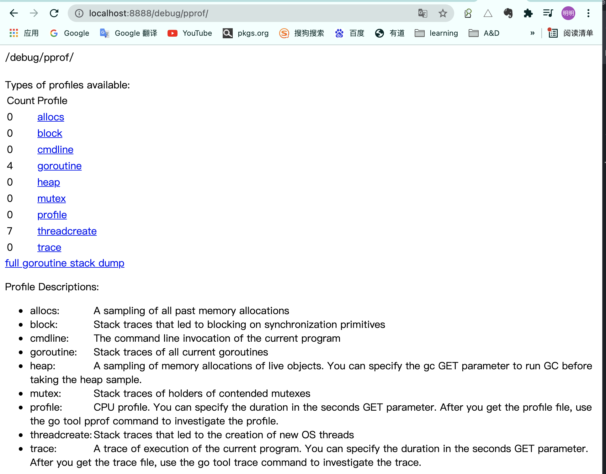

## 第13章 http及其他标准库
### 13-1 http标准库
- http.NewRequest
- http.Client
- httputil.DumpResponse


```
func main() {
	request, err := http.NewRequest(
		http.MethodGet,
		"http://www.imooc.com", nil)
	//设置请求头
	request.Header.Add("User-Agent",
		"Mozilla/5.0 (iPhone; CPU iPhone OS 10_3 like Mac OS X) AppleWebKit/602.1.50 (KHTML, like Gecko) CriOS/56.0.2924.75 Mobile/14E5239e Safari/602.1")

	client := http.Client{
		CheckRedirect: func(
			req *http.Request,
			via []*http.Request) error {
			fmt.Println("Redirect:", req)
			return nil
		},
	}
	resp, err := client.Do(request)
	if err != nil {
		panic(err)
	}
	defer resp.Body.Close()
	
	s, err := httputil.DumpResponse(resp, true)
	if err != nil {
		panic(err)
	}

	fmt.Printf("%s\n", s)
}
```

**网页性能分析**  
- import _ "net/http/pprof" 
- 访问/debug/pprof 
- 使用go tool pprof 分析性能  

网页继承pprof, 首先集成依赖, 通过/debug/pprof访问  
```
import (
	_ "net/http/pprof"
)
```

<br>
<div align=center>
</img>  
</div>
<br>


### 13-2 其它标准库
- bufio //具有buffer的io,速度快, flush  
- log   
- encoding/json 
- regexp //正则表达式
- time 
- strings/math/rand 

**如何查看标准库文档**  
- godoc -http:8888 
- [study-golang](https://studygolang.com/pkgdoc)  


### 13-3 json数据格式的处理
- **json 常用格式是小写, 单词之前使用"_"分割**    
- struct首字母大写才是public, 如果结构体首字母小写, 无法访问字段! json.Unmarshal  
- 如果不想使用变量名, 可在变量申明后增加 \`json:id\`, json tag
   

```
// 自定义json字段名称 
type Order struct {
	ID         string      `json:"id"`
	Items      []OrderItem `json:"items"`
	TotalPrice float64     `json:"total_price"`
}


func marshal() {
	o := Order{
		ID:         "1234",
		TotalPrice: 20,
		Items: []OrderItem{
			{
				ID:    "item_1",
				Name:  "learn go",
				Price: 15,
			},
			{
				ID:    "item_2",
				Name:  "interview",
				Price: 10,
			},
		},
	}

	b, err := json.Marshal(o) //首字母大写才是public, 如果结构体首字母小写, 无法访问字段  
	if err != nil {
		panic(err)
	}

	fmt.Printf("%s\n", b)
}

func unmarshal() {
	s := `{"id":"1234","items":[{"id":"item_1","name":"learn go","price":15},{"id":"item_2","name":"interview","price":10}],"total_price":20}`
	var o Order
	err := json.Unmarshal([]byte(s), &o)  // 需要取地址 
	if err != nil {
		panic(err)
	}
	fmt.Printf("%+v\n", o)
}
```

### 13-4 第三方API数据格式的解析技巧
- json的解析, 还是使用结构体接收,然后使用"."直接调用  


```
func parseNLP() {
	res := `{
"data": [
    {
        "synonym":"",
        "weight":"0.6",
        "word": "真丝",
        "tag":"材质"
    },
    {
        "synonym":"",
        "weight":"0.8",
        "word": "韩都衣舍",
        "tag":"品牌"
    },
    {
        "synonym":"连身裙;联衣裙",
        "weight":"1.0",
        "word": "连衣裙",
        "tag":"品类"
    }
]
}`
	m := struct {
		Data []struct {
			Synonym string `json:"synonym"`
			Tag     string `json:"tag"`
		} `json:"data"`
	}{}
	err := json.Unmarshal([]byte(res), &m)
	if err != nil {
		panic(err)
	}

	fmt.Printf("%+v, %+v\n", m.Data[2].Synonym, m.Data[2].Tag)
}
```

### 13-5 gin 框架介绍
- gin-gonic/gin (读音: jin, 第二声)  

[gin官网](https://github.com/gin-gonic/gin)

```
package main

import "github.com/gin-gonic/gin"

func main() {
	r := gin.Default()
	r.GET("/ping", func(c *gin.Context) {
		c.JSON(200, gin.H{
			"message": "pong",
		})
	})
	r.Run() // listen and serve on 0.0.0.0:8080 (for windows "localhost:8080")
}
```


### 13-6 为gin增加middleware(中间件)
首先查看middleware的位置: `Client 請求 <-> Go Http server <-> Middleware <-> Handle Function`  

- gin.Default().Use(func(c *gin.Context) 

```
func main() {
	r := gin.Default()
	logger, err := zap.NewProduction()
	if err != nil {
		panic(err)
	}

	// middleware, 类似java aop, 作用于日志打印 
	// c.Request.URL.Path c.Writer.Status( 
	r.Use(func(c *gin.Context) {
		s := time.Now()

		c.Next()

		logger.Info("incoming request",
			zap.String("path", c.Request.URL.Path),
			zap.Int("status", c.Writer.Status()),
			zap.Duration("elapsed", time.Now().Sub(s)))
	}, func(c *gin.Context) {
		c.Set(keyRequestId, rand.Int())

		c.Next()
	})

	r.GET("/ping", func(c *gin.Context) {
		h := gin.H{
			"message":   "pong",
		}
		if rid, exists := c.Get(keyRequestId); exists {
			h[keyRequestId] = rid
		}
		c.JSON(200, h)
	})
	r.GET("/hello", func(c *gin.Context) {
		c.String(200, "hello")
	})
	r.Run()
}
```