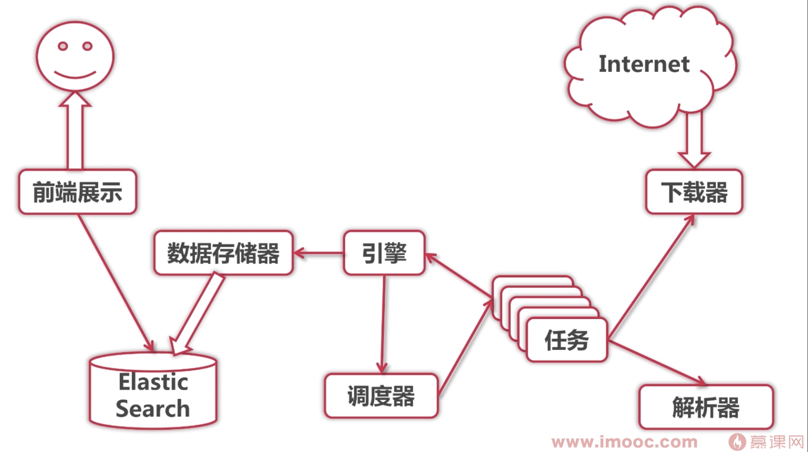

## 第1章 课程介绍
#### 1-1 Google资深工程师深度讲解go语言最近学习
**go语言发展趋势**  
Go 进入编程语言排名前十，占比 7%  
Go 语言最受欢迎的领域是 Web 服务  
Go 语言主要被用在 IT 和金融行业  

**go语言与开发速度**  
- 开发
- 运行快
- 不负(技术)债  

**Go语言与猜画小哥**  
微信公众号的小程序,可以通过用户绘制的图形，服务器猜出是什么?后端就是使用Go实现的.  

**Go语言与转型**  
-  项目转型首选语言
-  软件工程师转型、添加技术栈的首选语言
-  这是一门为转型量身定制的课程

**Go语言特点**  
- 没有对象，没有继承多态，没有泛型，没有try/catch
- 有接口，函数式编程，CSP并发模型(goroutine + channel) 

**课程项目总体结构**    

 

</img>  

 

 

</img>  

 

实战项目实现步骤  
单任务版 => 并发版 => 分布式

#### 1-2 安装与环境
#### 1-3 国内镜像配置
#### 1-4 IntelliJ Idea 的安装和配置
#### 1-5 vscode 的安装和配置