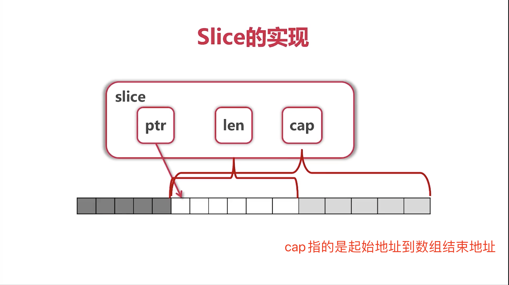

## 第3章 内建容器
### 3-1 数组
- 数量写在类型前  
- 数组遍历是,可通过_省略变量
- range函数比较简洁明确
- 数组是值类型, 方法传递数组时, 是会拷贝数组, 需要使用数组指针就很麻烦, **一般不使用数组**  

```
// 数组声明方式
var arr1 [5]int
arr2 := [3]int{1, 3, 5}
arr3 := [...]int{2, 4, 6, 8, 10} // ... 编译器计算个数
var grid [4][5]int

数组遍历
func printArray(arr [5]int) {
	arr[0] = 100
	// for _, v := range arr { //不需要下标
	for i, v := range arr {
		fmt.Println(i, v)
	}
}
```

### 3-2 切片的概念

- slice可以向后扩展, 不可以向前扩展
- s[i]不可以超越len(s), 向后扩展不可以超越底层数组cap(s)
  
<br>
<div align=center>
</img>  
</div>
<br>

```

func updateSlice(s []int) {
	s[0] = 100
}

func main() {
	// 数组, 需要有具体数量要求
	arr := [...]int{0, 1, 2, 3, 4, 5, 6, 7}
	
	//切片
	fmt.Println("arr[2:6] =", arr[2:6])
	fmt.Println("arr[:6] =", arr[:6])
	s1 := arr[2:] 
	fmt.Println("s1 =", s1)
	s2 := arr[:] //全部的元素
	fmt.Println("s2 =", s2)

	fmt.Println("After updateSlice(s1)")
	updateSlice(s1)
	fmt.Println(s1)
	fmt.Println(arr)

	fmt.Println("After updateSlice(s2)")
	updateSlice(s2)
	fmt.Println(s2)
	fmt.Println(arr)

	// 重新分配
	fmt.Println("Reslice")
	fmt.Println(s2)
	s2 = s2[:5]
	fmt.Println(s2)
	s2 = s2[2:]
	fmt.Println(s2)

	// 
	fmt.Println("Extending slice")
	arr[0], arr[2] = 0, 2
	fmt.Println("arr =", arr)
	s1 = arr[2:6]
	s2 = s1[3:5] // [s1[3], s1[4]]
	fmt.Printf("s1=%v, len(s1)=%d, cap(s1)=%d\n",
		s1, len(s1), cap(s1))
	fmt.Printf("s2=%v, len(s2)=%d, cap(s2)=%d\n",
		s2, len(s2), cap(s2))

	s3 := append(s2, 10)
	s4 := append(s3, 11)
	s5 := append(s4, 12)
	fmt.Println("s3, s4, s5 =", s3, s4, s5)
	// s4 and s5 no longer view arr.
	fmt.Println("arr =", arr)

	// Uncomment to run sliceOps demo.
	// If we see undefined: sliceOps
	// please try go run slices.go sliceops.go
	fmt.Println("Uncomment to see sliceOps demo")
	// sliceOps()
}
```
<br>
打印输出

```
arr[2:6] = [2 3 4 5]
arr[:6] = [0 1 2 3 4 5]
s1 = [2 3 4 5 6 7]
s2 = [0 1 2 3 4 5 6 7]
After updateSlice(s1)
[100 3 4 5 6 7]
[0 1 100 3 4 5 6 7]
After updateSlice(s2)
[100 1 100 3 4 5 6 7]
[100 1 100 3 4 5 6 7]
Reslice
[100 1 100 3 4 5 6 7]
[100 1 100 3 4]
[100 3 4]
Extending slice
arr = [0 1 2 3 4 5 6 7]
s1=[2 3 4 5], len(s1)=4, cap(s1)=6
s2=[5 6], len(s2)=2, cap(s2)=3
s3, s4, s5 = [5 6 10] [5 6 10 11] [5 6 10 11 12]
arr = [0 1 2 3 4 5 6 10]
Uncomment to see sliceOps demo
```

### 3-3 切片的操作

向slice添加元素
- 添加元素如果超过cap, 系统会分配更大的底层数组, 原来的数组会垃圾回收掉 
- 由于值传递的关系, 必须接收append的返回值


```
数组进行其他append操作时, slice中数组指针的地址没有偏移
> main.main() ./test.go:7 (PC: 0x10abaab)
     2:	
     3:	import "fmt"
     4:	
     5:	func main(){
     6:		s1 := []int{2, 4, 6, 8}
=>   7:		s1 = append(s1, 10)
     8:	
     9:		fmt.Println(s1)
    10:	}
(dlv) print &s1  // s1变量的地址
(*[]int)(0xc000067f40)
(dlv) x -fmt hex -count 24 -size 1 0xc000067f40  //s1内容
0xc000067f40:   0x40   0x61   0x01   0x00   0xc0   0x00   0x00   0x00   // array指针 0xc000016140
0xc000067f48:   0x04   0x00   0x00   0x00   0x00   0x00   0x00   0x00   // cap = 4
0xc000067f50:   0x04   0x00   0x00   0x00   0x00   0x00   0x00   0x00   // len = 4
(dlv) n
> main.main() ./test.go:9 (PC: 0x10abae3)
     4:	
     5:	func main(){
     6:		s1 := []int{2, 4, 6, 8}
     7:		s1 = append(s1, 10)
     8:	
=>   9:		fmt.Println(s1)
    10:	}
(dlv) x -fmt hex -count 24 -size 1 0xc000067f40
0xc000067f40:   0x40   0x82   0x01   0x00   0xc0   0x00   0x00   0x00   // array指针 0xc000016140
0xc000067f48:   0x05   0x00   0x00   0x00   0x00   0x00   0x00   0x00   // cap = 4
0xc000067f50:   0x08   0x00   0x00   0x00   0x00   0x00   0x00   0x00   // len = 4
(dlv) print s1
[]int len: 5, cap: 8, [2,4,6,8,10


数组进行弹出操作时, slice中数组指针指向的地址偏移了
> main.main() ./test.go:7 (PC: 0x10abaa0)
     2:	
     3:	import "fmt"
     4:	
     5:	func main(){
     6:		s1 := []int{2, 4, 6, 8}
=>   7:		s1 = s1[1:]
     8:	
     9:		fmt.Println(s1)
    10:	}
(dlv) print &s1
(*[]int)(0xc00006ff40)
(dlv) x -fmt hex -count 24 -size 1 0xc00006ff40
0xc00006ff40:   0x40   0x61   0x01   0x00   0xc0   0x00   0x00   0x00   // array指针0xc000016140
0xc00006ff48:   0x04   0x00   0x00   0x00   0x00   0x00   0x00   0x00   // len = 4
0xc00006ff50:   0x04   0x00   0x00   0x00   0x00   0x00   0x00   0x00  // cap = 4

> main.main() ./test.go:9 (PC: 0x10ababf)
     4:	
     5:	func main(){
     6:		s1 := []int{2, 4, 6, 8}
     7:		s1 = s1[1:]
     8:	
=>   9:		fmt.Println(s1)
    10:	}
(dlv) x -fmt hex -count 24 -size 1 0xc00006ff40
0xc00006ff40:   0x48   0x61   0x01   0x00   0xc0   0x00   0x00   0x00   // array指针0xc000016148, 向后移了8个字节
0xc00006ff48:   0x03   0x00   0x00   0x00   0x00   0x00   0x00   0x00   //len = 3
0xc00006ff50:   0x03   0x00   0x00   0x00   0x00   0x00   0x00   0x00   //cap = 3

```

### 3-4 Map
- 创建: make(map[key]value)  
- 获取元素: v, ok = m[key]
- 删除元素: delete(map, key)
- 遍历元素: key, value := range map , key是无序的
- 获取元素格式: len(map) 
- map的key使用hash表，必须可以比较相等, 除了slice,map,function的内建类型都可以作为key, struct类型只要不包含上述字段,也可以作为key


```
func main() {
	//map[course:golang name:ccmouse quality:notbad site:imooc]
	m := map[string]string{
		"name":    "ccmouse",
		"course":  "golang",
		"site":    "imooc",
		"quality": "notbad",
	}
	// map[]
	m2 := make(map[string]int) // m2 == empty map 
    // map[]
	var m3 map[string]int // m3 == nil

	fmt.Println("m, m2, m3:")
	fmt.Println(m, m2, m3)

	//map遍历
	fmt.Println("Traversing map m")
	for k, v := range m {
		fmt.Println(k, v)
	}

	fmt.Println("Getting values")
	courseName := m["course"]
	fmt.Println(`m["course"] =`, courseName)
	// 可以有两个返回值
	if causeName, ok := m["cause"]; ok { // key不存在, 返回空值
		fmt.Println(causeName)
	} else {
		fmt.Println("key 'cause' does not exist")
	}

	fmt.Println("Deleting values")
	name, ok := m["name"]
	fmt.Printf("m[%q] before delete: %q, %v\n",
		"name", name, ok)

	delete(m, "name")
	name, ok = m["name"]
	fmt.Printf("m[%q] after delete: %q, %v\n",
		"name", name, ok)
}
```

### 3-5 Map例题
**寻找最长不包含重复字符的子串**  
- abcabcbb => abc
- bbbbbb => b
- pwwkew => wke
  
我最初的想法是把字符进行从大到小拆分, 如果字符的长度为l，那就从l~1开始拆分,直到找到不重复的子串.  

- lastOccurred[x]不存在, 或者 < start -> 无序操作
- lastOccurred[x] >= start 	-> 更新start
- 更新lastOccurred[x]， 更新maxLength
  
```
func lengthOfNonRepeatingSubStr(s string) int {
	lastOccurred := make(map[rune]int)
	start := 0
	maxLength := 0

	for i, ch := range []rune(s) {
		if lastI, ok := lastOccurred[ch]; ok && lastI >= start {
			start = lastI + 1
		}
		if i-start+1 > maxLength {
			maxLength = i - start + 1
		}
		lastOccurred[ch] = i
	}

	return maxLength
}

func main() {
	fmt.Println(
		lengthOfNonRepeatingSubStr("abcabcbb"))
	fmt.Println(
		lengthOfNonRepeatingSubStr("bbbbb"))
	fmt.Println(
		lengthOfNonRepeatingSubStr("pwwkew"))
	fmt.Println(
		lengthOfNonRepeatingSubStr(""))
	fmt.Println(
		lengthOfNonRepeatingSubStr("b"))
	fmt.Println(
		lengthOfNonRepeatingSubStr("abcdef"))
	fmt.Println(
		lengthOfNonRepeatingSubStr("这里是慕课网"))
	fmt.Println(
		lengthOfNonRepeatingSubStr("一二三二一"))
	fmt.Println(
		lengthOfNonRepeatingSubStr(
			"黑化肥挥发发灰会花飞灰化肥挥发发黑会飞花"))
}
```

打印输出
```
3
1
3
0
1
6
6
3
8
```

> 这个题目的描述有点问题, 当字符串时abcabcbb => abc, 我就思考为什么不是bca, 或者cab, 原来是计算长度  

### 3-6 字符和字符串处理  

**rune相当于go的char**
- 使用range遍历, pos, rune对, pos英文是增加1, 中文是增加3 
- 使用utf8.RuneCountInString获得字符数量
- 使用len获得字节长度(utf-8的长度)
- 使用[]byte获取字节
- 其他字符串操作: Fields, Split, Join
- Contains, Index
- ToLower, ToUpper
- Trim, TrimRight, TrimLeft


```
import (
	"fmt"
	"unicode/utf8"
)

func main() {
	s := "Yes我爱慕课网!" // UTF-8  每个中文三个字节
	fmt.Println(s)

	for _, b := range []byte(s) {
		fmt.Printf("%X ", b)
	}
	fmt.Println()

	for i, ch := range s { // ch is a rune (int32)
		fmt.Printf("(%d %X) ", i, ch)
	}
	fmt.Println()

	fmt.Println("Rune count:",
		utf8.RuneCountInString(s))  // 9个字节, 每个中文两个字节

	bytes := []byte(s)
	for len(bytes) > 0 {
		ch, size := utf8.DecodeRune(bytes)
		bytes = bytes[size:]  // 循环遍历
		fmt.Printf("%c ", ch)
	}
	fmt.Println()

	for i, ch := range []rune(s) {
		fmt.Printf("(%d %c) ", i, ch)
	}
	fmt.Println()
}
```

打印输出
```
Yes我爱慕课网!
59 65 73 E6 88 91 E7 88 B1 E6 85 95 E8 AF BE E7 BD 91 21 
(0 59) (1 65) (2 73) (3 6211) (6 7231) (9 6155) (12 8BFE) (15 7F51) (18 21) 
Rune count: 9
Y e s 我 爱 慕 课 网 ! 
(0 Y) (1 e) (2 s) (3 我) (4 爱) (5 慕) (6 课) (7 网) (8 !) 
```