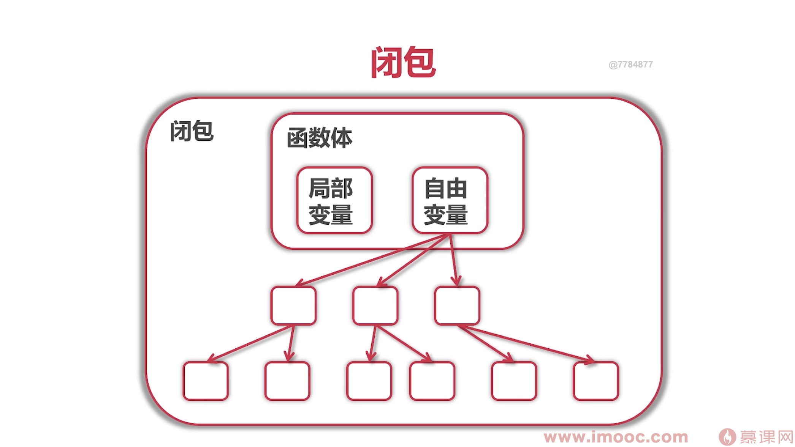

## 第7章 函数式编程
### 7-1 函数式编程
- go作为通用语言, 对函数式编程的体现主要在闭包上面  

**闭包的概念(属性+方法)**  


一个函数和对其周围状态（lexical environment，词法环境）的引用捆绑在一起（或者说函数被引用包围），这样的组合就是闭包（closure）。
  
闭包很有用，因为它允许将**函数与其所操作的某些数据(环境)关联起来**， 这显然类似于面向对象编程。在面向对象编程中，对象允许我们将某些数据(对象的属性)与一个或者多个方法相关联。  
因此，通常你使用只有一个方法的对象的地方，都可以使用闭包。

**正统的函数式编程**  
- 不可变性: 不能有状态, 只有常量和函数  
- 函数只能有一个参数  

> adder() adder函数返回的就是一个闭包, 不仅返回一个函数, 而且返回对sum的引用. 函数里相当于保存了sum变量的地址    
```
// 问题就是sum是方法申请局部变量, 已经出现逃逸
func adder() func(int) int { 
	sum := 0
	return func(v int) int {
		sum += v           //自由变量
		return sum
	}
}

type iAdder func(int) (int, iAdder)

func adder2(base int) iAdder {
	return func(v int) (int, iAdder) {
		return base + v, adder2(base + v)
	}
}

func main() {
	a := adder() //is trivial and also works. // dlv打印 &a = (*func(int) int)(0xc0000a5ed8)
	for i := 0; i < 10; i++ {
		fmt.Println(a(i))
		//fmt.Println(adder()(i)) //这样输出的就是0,1,2,3,4,5,6,7,8,9
	}

	a1 := adder2(0)
	for i := 0; i < 10; i++ {
		var s int
		s, a1 = a1(i)
		fmt.Printf("0 + 1 + ... + %d = %d\n",
			i, s)
	}
}
```


### 7-2 函数式编程例一

```
type intGen func() int

// 实现Reader接口
// 能够给函数实现接口, 证明Go语言中函数式一等公民
func (g intGen) Read(
	p []byte) (n int, err error) {
	next := g()
	if next > 10000 {
		return 0, io.EOF
	}
	s := fmt.Sprintf("%d\n", next)

	// TODO: incorrect if p is too small!
	return strings.NewReader(s).Read(p)
}
```

### 7-3 函数式编程例二


