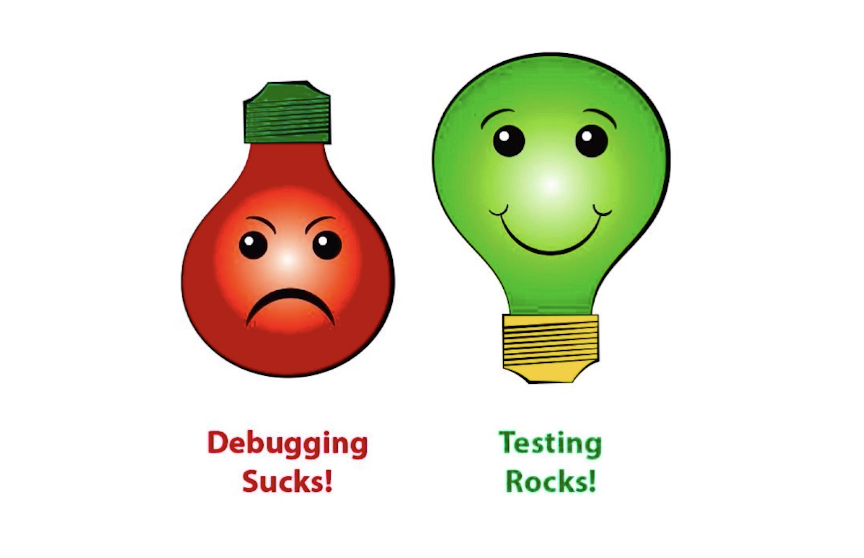
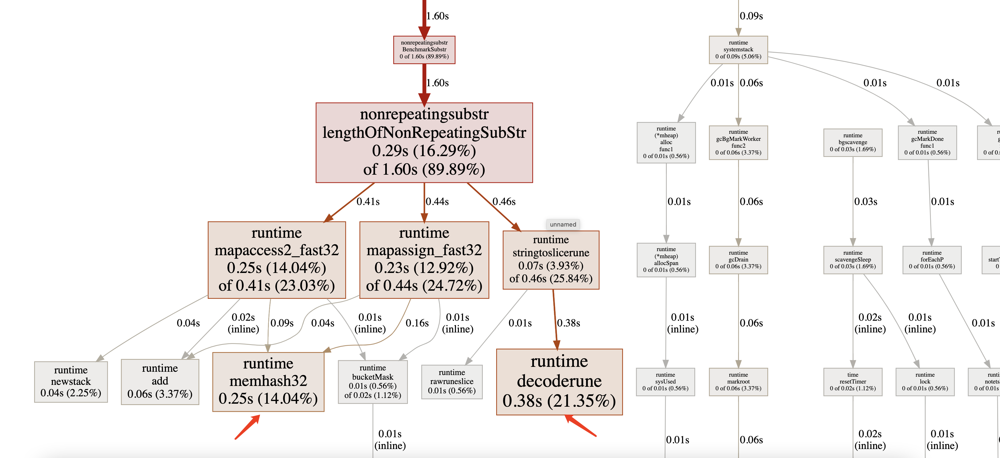

## 第9章 测试与性能调优
### 9-1 测试
- Debugging Sucks ! Testing Rocks!
<br>
<div align=center>
</img>  
</div>
<br>

**传统测试**  
- 测试数据和逻辑混在一起  
- 出错信息不明确
- 一旦出错, 程序就停止

**表格驱动测试**
- 分离测试数据和测试逻辑  
- 明确的出错信息  
- 可以部分失败   

```
// 文件命名 测试功能_test.go
func TestTriangle(t *testing.T) {
	tests := []struct{ a, b, c int }{  //测试数据
		{3, 4, 5},
		{5, 12, 13},
		{8, 15, 17},
		{12, 35, 37},
		{30000, 40000, 50000},
	}

	for _, tt := range tests {//进行测试
		if actual := calcTriangle(tt.a, tt.b); actual != tt.c {
			t.Errorf("calcTriangle(%d, %d); "+
				"got %d; expected %d",
				tt.a, tt.b, actual, tt.c)
		}
	}
}
```
 
### 9-2 代码覆盖率和性能测试  
- 测试代码的覆盖率 go tool cover 
- 性能测试 go test -bench 

### 9-3 使用pprof进行性能调优
- go tool pprof 查看性能 

//首先生成profile文件  获取性能数据  
go test -bench . -cpuprofile cpu.out   

//查看profile  查看性能数据  
go tool pprof cpu.out 

//web 查看图片 方框越大和线越粗的地方就是耗时较多的地方  

> 需要安装Graphviz failed to execute dot. Is Graphviz installed? Error: exec: "dot": executable file not found in $PATH  
> 下载页面: https://graphviz.org/download/  
> mac brew install graphviz 

```
zerodeMacBook-Pro:nonrepeatingsubstr zero$ go test -bench . -cpuprofile cpu.out 
goos: darwin
goarch: amd64
pkg: imooc.com/ccmouse/learngo/lang/container/nonrepeatingsubstr
cpu: Intel(R) Core(TM) i5-7267U CPU @ 3.10GHz
BenchmarkSubstr-4            195           7932246 ns/op
--- BENCH: BenchmarkSubstr-4
    nonrepeating_test.go:41: len(s) = 491520
    nonrepeating_test.go:41: len(s) = 491520
    nonrepeating_test.go:41: len(s) = 491520
PASS
ok      imooc.com/ccmouse/learngo/lang/container/nonrepeatingsubstr     2.338s
```


<br>
<div align=center>
    </img>  
</div>
<br>


### 9-4 测试http服务器（上）
### 9-5 测试http服务器（下）
- 通过假的Request/Response  
- 独立服务器进行测试  

### 9-6 生成文档和示例代码
- go doc 查看文档的
- godoc 生成文档  

> godoc 在go1.3之后拿掉了, 现在需要单独安装go get golang.org/x/tools/cmd/godoc     

### 9-7 测试总结
- 表格驱动测试  
- 