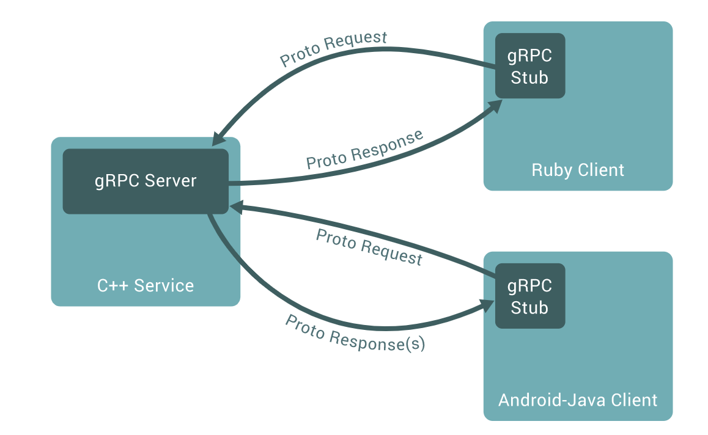
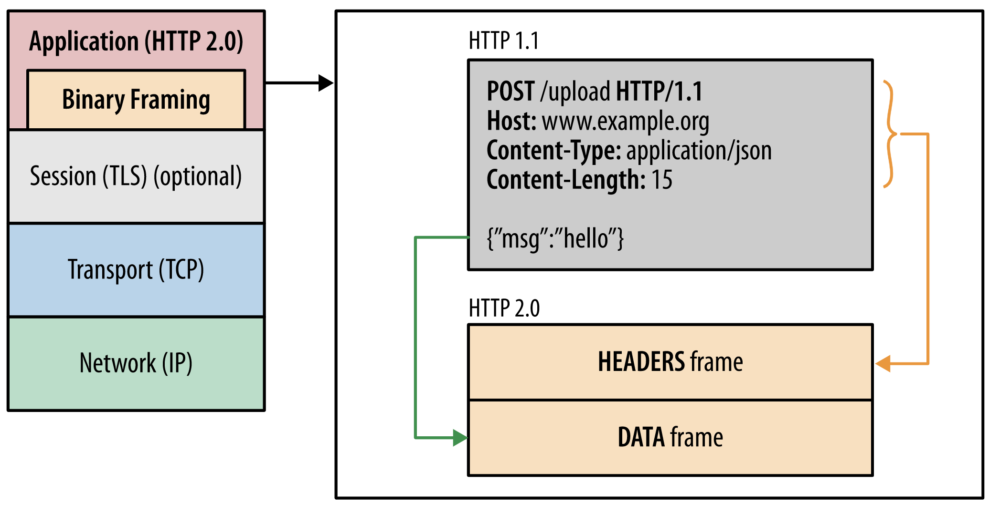
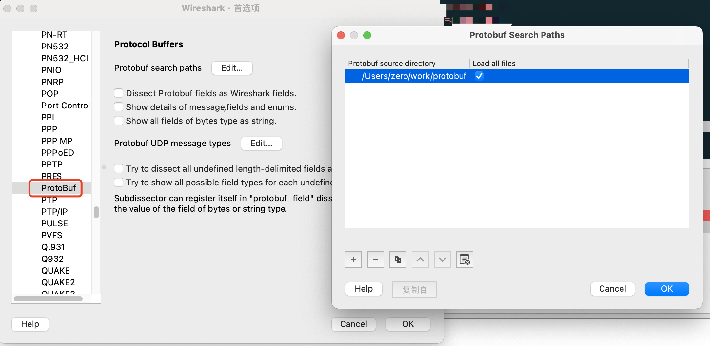
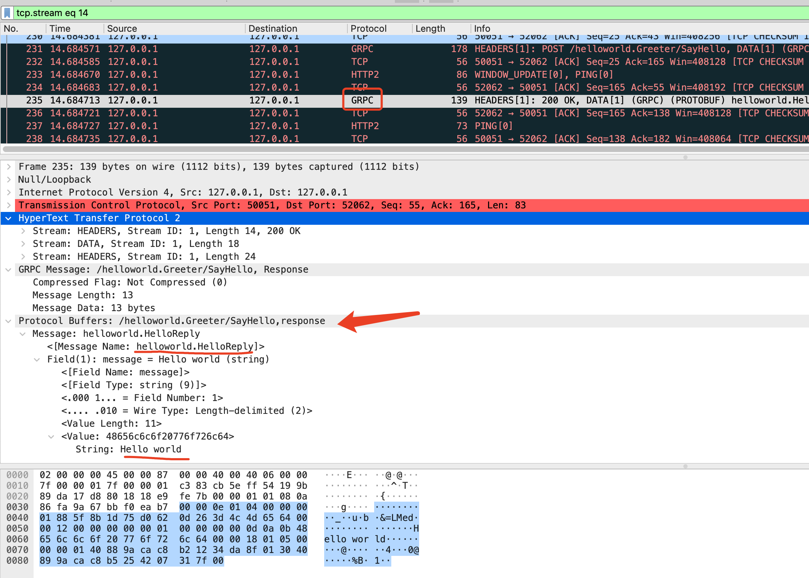

# gRPC Hello World

Follow these setup to run the [quick start][] example:

hellowork.proto 
```
// Copyright 2015 gRPC authors.
//
// Licensed under the Apache License, Version 2.0 (the "License");
// you may not use this file except in compliance with the License.
// You may obtain a copy of the License at
//
//     http://www.apache.org/licenses/LICENSE-2.0
//
// Unless required by applicable law or agreed to in writing, software
// distributed under the License is distributed on an "AS IS" BASIS,
// WITHOUT WARRANTIES OR CONDITIONS OF ANY KIND, either express or implied.
// See the License for the specific language governing permissions and
// limitations under the License.

syntax = "proto3";

option go_package = "google.golang.org/grpc/examples/helloworld/helloworld";
option java_multiple_files = true;
option java_package = "io.grpc.examples.helloworld";
option java_outer_classname = "HelloWorldProto";

package helloworld;

// The greeting service definition.
service Greeter {
  // Sends a greeting
  rpc SayHello (HelloRequest) returns (HelloReply) {}
}

// The request message containing the user's name.
message HelloRequest {
  string name = 1;
}

// The response message containing the greetings
message HelloReply {
  string message = 1;
}
```

 1. Get the code:

    ```console
    $ go get google.golang.org/grpc
    
    //如果移动到其他项目, 需要改变import的包路径,自己的moduleName+包路径
    //moduleName:imooc.com/ccmouse/learngo, 包路径:lang/rpc/grpc/helloworld/helloworld
    import pb "imooc.com/ccmouse/learngo/lang/rpc/grpc/helloworld/helloworld"
    ```

 2. Run the server:

    ```console
    cd helloworld
    
    go run greeter_server/main.go
    
    $ go run greeter_client/main.go
    2021/10/19 19:34:50 Greeting: Hello world
    ```

 3. Run the client:

    ```console
    $ $(go env GOPATH)/bin/greeter_client
    Greeting: Hello world
    ```

如果需要修改proto文件,需要重新生成`helloworld/helloworld.pb.go` and `helloworld/helloworld_grpc.pb.go` 
```
$ protoc --go_out=. --go_opt=paths=source_relative \
    --go-grpc_out=. --go-grpc_opt=paths=source_relative \
    helloworld/helloworld.proto
```

For more details (including instructions for making a small change to the
example code) or if you're having trouble running this example, see [Quick
Start][].

[quick start]: https://grpc.io/docs/languages/go/quickstart  

# gRPC实现  
## [概述](https://grpc.io/docs/what-is-grpc/introduction/)  
在 gRPC 中，客户端应用程序可以直接调用不同机器上的服务器应用程序上的方法，就像它是本地对象一样，使您可以更轻松地创建分布式应用程序和服务。与许多 RPC 系统一样，gRPC 基于定义服务的思想，指定可以通过参数和返回类型远程调用的方法。在服务器端，服务器实现了这个接口并运行一个 gRPC 服务器来处理客户端调用。在客户端，客户端有一个存根（在某些语言中简称为客户端），它提供与服务器相同的方法。  

<br>
<div align=center>
</img>  
</div>
<br>


## 调用流程
- 客户端调用接口  

```
google.golang.org/grpc/internal/transport.(*controlBuffer).executeAndPut at controlbuf.go:332
google.golang.org/grpc/internal/transport.(*controlBuffer).put at controlbuf.go:311
google.golang.org/grpc/internal/transport.(*http2Client).Write at http2_client.go:890
google.golang.org/grpc.(*csAttempt).sendMsg at stream.go:868
google.golang.org/grpc.(*clientStream).SendMsg.func2 at stream.go:733
google.golang.org/grpc.(*clientStream).withRetry at stream.go:617
google.golang.org/grpc.(*clientStream).SendMsg at stream.go:739
google.golang.org/grpc.invoke at call.go:70
google.golang.org/grpc.(*ClientConn).Invoke at call.go:37
imooc.com/ccmouse/learngo/lang/rpc/grpc/helloworld/helloworld.(*greeterClient).SayHello at helloworld_grpc.pb.go:39
main.main at main.go:58
runtime.main at proc.go:225
runtime.goexit at asm_amd64.s:1371
 - Async stack trace
runtime.rt0_go at asm_amd64.s:226
```  

以上只是把数据入队(`enqueue`) controlbug还有一个轮询处理方法run(), 启动会调用`func (l *loopyWriter) processData() (bool, error)`方法处理队列中的数据(`dequeue`)  

- grpc与http2 ？

HTTP/2是什么  
<br>

<br>
<div align=center>
</img>  
</div>
<br>

- HTTP/1里的header对应HTTP/2里的 HEADERS frame  
- HTTP/1里的payload对应HTTP/2里的 DATA frame    

[wireshark查看grpc协议](https://grpc.io/blog/wireshark/)   
1. 首先选择wireshark配置>>Protocols>>ProtoBuf 设置proto文件路径
<br>
<div align=center>
</img>  
</div>
<br>

2. 找到tcp消息,右击选择Decode As, 设置current为http2
<br>
<div align=center>
</img>  
</div>
<br>

3. 查看协议
<br>
<div align=center>
</img>  
</div>
<br>


> TLS  
> 传输层安全性协议（英语：Transport Layer Security，缩写：TLS）及其前身安全套接层（英语：Secure Sockets Layer，缩写：SSL）是一种安全协议，目的是为互联网通信提供安全及数据完整性保障。网景公司（Netscape）在1994年推出首版网页浏览器－网景导航者时，推出HTTPS协议，以SSL进行加密，这是SSL的起源。IETF将SSL进行标准化，1999年公布TLS 1.0标准文件（RFC 2246）。随后又公布TLS 1.1（RFC 4346，2006年）、TLS 1.2（RFC 5246，2008年）和TLS 1.3（RFC 8446，2018年）。在浏览器、电子邮件、即时通信、VoIP、网络传真等应用程序中，广泛使用这个协议。许多网站，如Google、Facebook、Wikipedia等也以这个协议来创建安全连线，发送资料。目前已成为互联网上保密通信的工业标准。  
> SSL包含记录层（Record Layer）和传输层，记录层协议确定传输层数据的封装格式。传输层安全协议使用X.509认证，之后利用非对称加密演算来对通信方做身份认证，之后交换对称密钥作为会谈密钥（Session key）。这个会谈密钥是用来将通信两方交换的资料做加密，保证两个应用间通信的保密性和可靠性，使客户与服务器应用之间的通信不被攻击者窃听。  

grpc不是性能优先的(一次从调用,两次解码),而是注重跨平台统一通信(支持物联网、手机、浏览器)，支持鉴权,安全保证.   

